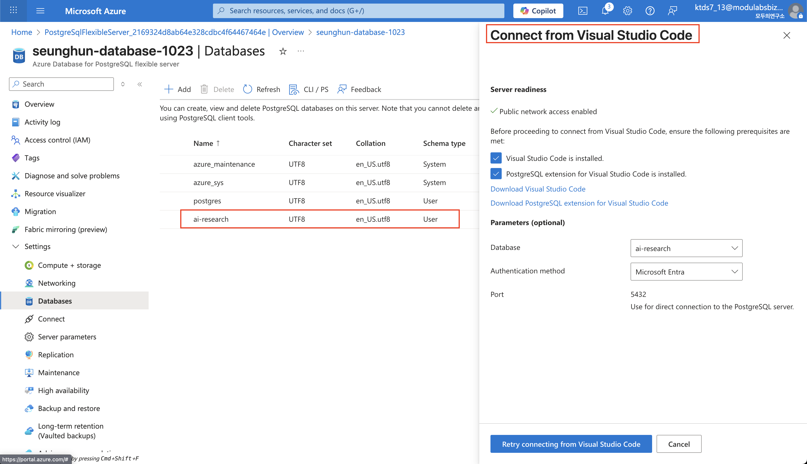
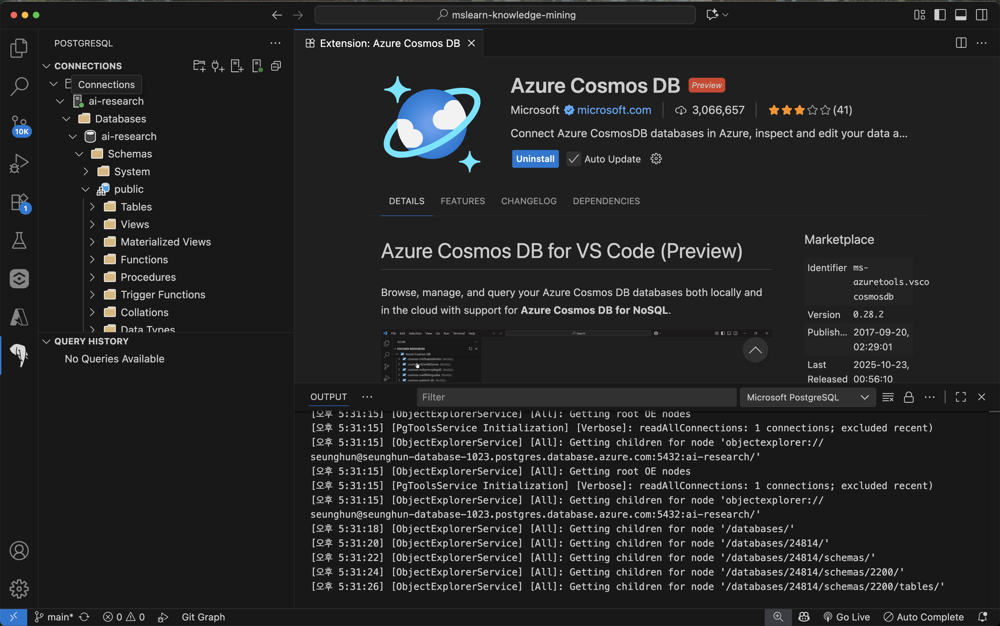

# AI 기술 리서치 플랫폼

### 간단 설명
자동으로 최신 AI 논문·오픈소스·모델 정보를 수집·요약·시각화하여 리서치 비용과 시간을 절감하는 멀티에이전트 기반 리서치 플랫폼.

### 목적
- 급변하는 AI 기술 트렌드를 자동화해 연구 효율성 향상
- 키워드 기반 기술 검색과 타겟 도메인 기반 기술 검색을 통한 기술 역량 강화
- `고도화 항목` 기술 관계도 제공 및 커뮤니티 기반 지식 허브 구축 

### 기술 스택
- streamlit
- python 3.12
- UV Package Manager
- LangChain, LangGraph (Agent 오케스트레이션)
- Azure: AI Search, OpenAI, MCP Server
- `고도화 항목` Neo4j

### 핵심 기능

1. 키워드 기반 리서치 Agent 구축
    - LangGraph 기반 Multi-Agent 구축
    - arXiv, GitHub, Hugging Face 등 MCP Server 활용 (Azure MCP Server, AI Search)

2. 도메인 기반 리서치 Agent 구축
    - Tavily MCP Server 사용 (Azure MCP Server)

4. 검색된 자료 Storage 업로드 및 RAG Agent 구축 (Storage Accout, Blob Storage, AI Search)

5. `고도화 항목` Document 대시보드 구축

6. `고도화 항목` 기술 관계도 시각화
    - 검색된 Docuemnt의 keyword 추출하여 지식 허브의 Document keyword 기반 관계도 생성
    - Neo4j 기반 지식 그래프 생성

---

## Database 생성 및 연동

- 데이터베이스 생성

- VS Code를 통한 Azure PostgreSQL Database 연동

