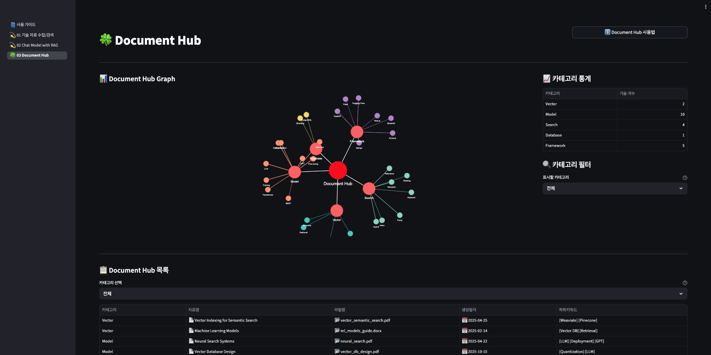
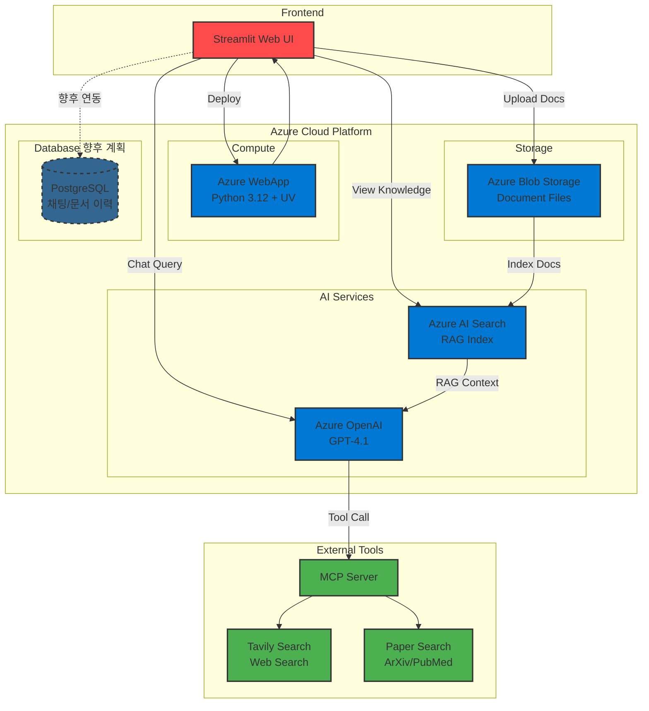

<div align="center">

<h1>ASAP (AI Search Agent Platform)</h1>

<p>도메인·문서 기반 RAG 리서치와 지식 허브를 한 곳에서 <a href="https://pro-seunghun-poland-web.azurewebsites.net" target="_blank">🌐 ASAP Domain Link</a>
</p> 



<p>
  
  
  
  
  
</p>


</div>

---

## 🤔 왜 ASAP인가?

최신 AI 기술 트렌드를 빠르게 인지하고, 관련 지식 문서를 학습하여 서비스에 반영하는 작업을 진행하면서, 이러한 리서치 과정과 지식 문서 관리를 체계화하고 효율화하기 위해 이 플랫폼을 구축

- 최신 AI 기술 트렌드의 빠른 변화에 따른 **기술 리서치 비용 감소**
- 관련 전문 **지식 문서의 수집**과 **문서 기반 에이전트 채팅**을 통한 기술 역량 향상
- 휘발성 학습이 아닌 **학습한 자료를 영구적으로 보관 및 공유**

---


## 🚀 빠른 시작(Quick Start)

- 의존성 설치 및 실행

```bash
# uv 설치 (없다면)
curl -LsSf https://astral.sh/uv/install.sh | sh

# 패키지 동기화
uv sync

# 실행
uv run streamlit run main.py --server.port 8000 --server.address 0.0.0.0
```
---

## 🛠️ 활용 기술 스택

| 카테고리 | 기술/서비스 | 설명 |
|---------|------------|------|
| **언어/런타임** | python 3.12 |  |
| **패키지 관리** | uv | Package Manager |
| **웹 프레임워크** | Streamlit | 서비스 UI 도구 활용 |
| **Azure 서비스** | Azure OpenAI | `gpt-4.1` model 사용<br/>커스텀 컨텐츠 필터 사용 : 검색 범위 확대 목적 |
| | Azure Blob Storage | 업로드 지식 문서 관리 |
| | Azure AI Search | 업로드 문서의 Index Document 등록을 통한 RAG에 활용<br/>문서의 `카테고리`, `키워드` 추출에 사용 |
| | Azure WebApp | Streamlit, UV 기반 소스 배포 |
| | PostgreSQL Database (개발 필요) | 사용자 별 채팅 및 파일 업로드 이력 관리<br/>업로드 문서 키워드, 카테고리 관리 |
| **외부 도구** | MCP Tool | 모델 학습 시기에 따른 최신 정보 부재 해결을 위해 도입<br/>- `tavily` : url 기반 문서 검색 도구<br/>- `paper search` : 주요 논문 검색 사이트인 arxiv, pubmed 등 논문 데이터를 수집하는 도구 |


---


## 🏗️ 시스템 아키텍처




---

## ⭐ 주요 기능 한눈에 보기

### 1. 기술 자료 수집 및 검색 기능

- **도메인 관리**: 관심 도메인 등록/초기화로 도메인 기반 검색 기능 구현
- **문서 등록**: 기술 문서 업로드를 통해 검색 데이터 추가 및 미리보기 기능 구현
- **색인 실행**: AI Search Document로 등록하여 검색 가능 상태 전환

### 2. Chat Model with RAG

- **RAG 질의응답**: 업로드한 Document 기반 답변 생성
- **도구 호출**: 외부 도구 결과와 모델 답변을 구분 표시 및 MCP 도구를 활용해 최신 검색 결과 반영
- **인용 표시**: 답변에 사용된 문서 청크 데이터, 도메인 출처 표시

### 3. Document Hub - 지식 데이터베이스 구축
- **지식 그래프**: [Document Hub] - [카테고리] - [키워드] 관계 시각화
- **카테고리 필터**: 선택된 카테고리 항목만 그래프/목록 반영
- **문서 목록**: 카테고리 별 Document Hub에 등록된 문서 목록 표시 및 페이지네이션


---

## 💡 핵심 기술 포인트

- MCP Server를 통한 모델 도구 호출 기능 구현

- Tag, Category 기반 문서 키워드 추출

- 에이전트 별 활용 목적에 따른 System Prompt 관리

- 개발 소스 추상화

- streamlit-agraph 라이브러리를 통한 데이터 시각화


---

## 📈 향후 개선 및 확장 계획

- 도메인 확장 : AI 기술 외 타 도메인으로의 확장

- 스토리지 구조 개선: 문서 메타데이터 스키마 고도화, 버전 관리

- RAG 품질 향상: Vector Embedding, Hybrid Search, 프롬프트 엔지니어링

- 문서 Index 성능 개선 : 자동 Index 생성, 도메인, 카테고리 별 Index 생성

- 그래프 확장: Neo4j 연동(고도화된 지식 그래프 생성), 그래프, 문서 연동

---
